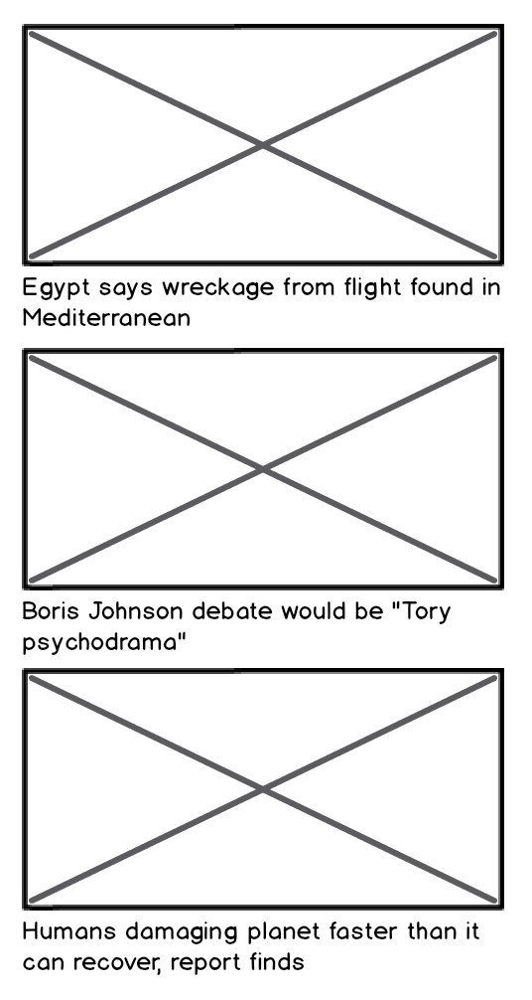
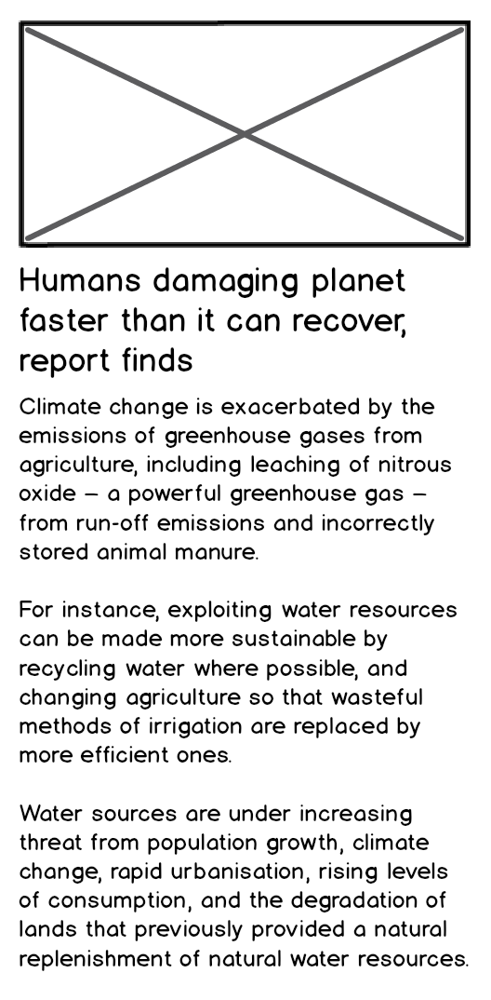

<!-- PROJECT SHIELDS -->
[![LinkedIn][linkedin-shield]](https://www.linkedin.com/in/sophie-beard-9a9842222/)


<!-- PROJECT LOGO -->
<br />
<div align="center">

<h1 align="center">Digital Futures' News Challenge</h1>

  <p align="center">
    
This was the fourth challenge as part of the Digital Future's academy. The task was to test-drive a single page application in React that sends requests to the Guardian API to get Headline and Article data and display them. This was my first time using ReactJS and implementing APIs into an application.   
    <br />
    <a href="[link to repo](https://github.com/sophiebeard/news-summary-challenge)"><strong>Explore the docs »</strong></a>
    <br />
    <a href="[link to repo](https://github.com/sophiebeard/news-summary-challenge)">Report Bug</a>
  </p>
</div>


<!-- TABLE OF CONTENTS -->
<details>
  <summary>Table of Contents</summary>
  <ol>
    <li>
      <a href="#about-the-project">About The Project</a>
    </li>
    <li>
      <a href="#getting-started">Getting Started</a>
    </li>
    <li>
      <a href="#project-plan">Project Plan</a>
    </li>
    <li><a href="#project-review">Project Review</a></li>
    <li><a href="#contributing">Contributing</a></li>
    <li><a href="#contact">Contact</a></li>
    <li><a href="#acknowledgments">Acknowledgments</a></li>
  </ol>
</details>


<!-- ABOUT THE PROJECT -->
## About The Project
### User Stories

#### Standard
```
As a busy politician
So I know what the big stories of the day are
I can see all of today's headlines in one place
```

```
As a busy politician
So that I have something nice to look at
I can see a relevant picture to illustrate each news article when I browse headlines
```

<p align="right">(<a href="#readme-top">back to top</a>)</p>


## Getting Started

This project was bootstrapped with [Create React App](https://github.com/facebook/create-react-app).

In the project directory, you can run:

### `npm start`

Runs the app in the development mode.\
Open [http://localhost:3000](http://localhost:3000) to view it in the browser.

The page will reload if you make edits.\
You will also see any lint errors in the console.

### `npm test`

Launches the test runner in the interactive watch mode.\
See the section about [running tests](https://facebook.github.io/create-react-app/docs/running-tests) for more information.

### `npm run build`

Builds the app for production to the `build` folder.\
It correctly bundles React in production mode and optimizes the build for the best performance.

The build is minified and the filenames include the hashes.\
Your app is ready to be deployed!

See the section about [deployment](https://facebook.github.io/create-react-app/docs/deployment) for more information.


<p align="right">(<a href="#readme-top">back to top</a>)</p>


## Project Plan

I will be following the steps outlined by Facebook for React application development:
- [ ] Start with a mock
- [ ] Break the UI into a component hierarchy
- [ ] Build a static version in React
- [ ] Identify the minimal representation of UI state
- [ ] Identify where state lives. 
- [ ] Add inverse data flow (not necessary for this project).

### Obtaining an API Key
The first thing I did was obtain an API key from the [Guardian Developer](https://open-platform.theguardian.com/access/) website. This was relatively straightforward, however, the web address given to me did not include access to the headline and thumbnail information, so I had to use a different web address. 

### Start with a Mock

The following mocks were provided for the Headlines and Article Summary pages. 

Headlines:
<br />


Article Summary: 
<br />


Mock data was provided in the mockNewsData.json file. This was used to prepare the static version. 

### Break the UI into a component hierarchy

I began by planning my component hierarchy using the following diagrams, edited from the Mockups given. For the headlines page, I originally began with the components: App, Header, Footer, Thumbnail, and Headline. However, when trying to implement my API into the application, I realised that it made sense for Thumbnail and Headline to inhert data from a parent Article component - so this was added in later on. 

Headlines:
<br />


For the article summary page, I am going to implement the same strategy, and include an Article component, as well as introducing a BodyText component. 

Article Summary:
<br />


<p align="right">(<a href="#readme-top">back to top</a>)</p>

### Build a static version in React

The static version was first build for the header and footer, as these remain constant throughout the application. They were built and then styled with CSS. These were testes using Snapshot testing, as this is useful for making sure that the UI does not change unexpectedly after rendering. 

Tests: 
1. Test that the Header component renders correctly. This was done using snapshot testing. 
2. Test that the Footer component renders correctly. This was done using snapshot testing.

Then, I built a static version of the Headlines page, using data from the mockNewsData.json file. This includes a parent Article component, and then Thumbnail and Headline components (being passed data as props). The Thumbnail component took information from the thumbnail, and headline props. The Headline component took information from the headline prop. Testing the props are rendered correctly will be done using render, which is used to create a representation of a component. Screen allows you to access the object and can be used to query the output using some query methods.  

Tests:
1. Test that the app should render a headline from props when the headline prop is given. 
2. Test that the app should render a thumbnail with a headline from props when the headline prop is given. 
3. Test that the app should render a thumbnail with a thumbnail from props when the thumbnail prop is given. 

### Identify the minimal representation of UI state

Data that can change should be considered as state. Data is passed in as props as HTML attributes when a component is created. We require the ability to trigger changes (when the application changes, we want the application to update the UI to show the most up to dat data). 

In this project, the state is the news articles. These are updated by the Guardian API, and therefore can be updated in the application.

### Identify where state lives

This involves identifying which component mutates or owns state. To work out where state should live: 
- Identify every component that renders something based on state. 
- Find common owner component. 
- Either a common component, or a component even higher up, should own the state. 
- If no component makes sense, create a new component to hold state and add it into the hierarchy above the common owner component. 

State can be set in the App component as the articles will be updated from the Guardian API, and therefore we can update this information using props.

### Adding the API

The API key was hidden in the .env file and accessed within the project. 

#### Extended Criteria

```
As a busy politician
So that I can get an in depth understanding of a very important story
I can click a news headline to see a summary and a photo of the news article
```

```
As a busy politician
So I can get a few more details about an important story
I can see click a news article summary title which links to the original article
```

```
As a busy politician
Just in case my laptop breaks
I can read the site comfortably on my phone
```

In order to tackle the extended criteria, I needed to refactor my code so that I could add routing and have separate webpages for the Headlines and the ArticleSummary. The routing was implemented using the 'react-router-dom' library. 

First, the BodyText component was created in order to create the second page. 

Tests:
1. It should render bodyText from props when the bodyText prop is given.

The bodyText component was implemented alongside the Headlines and Thumbnail components to create the ArticleSummaryPage. The final test was done using the <MemoryRouter > tag as routing had been incorporated. 

Tests: 
1. It should render a headline from props when the headline prop is given.
2. It should render a thumbnail from props when the thumbnail prop is given.
3. It should render bodyText from props when the bodyText prop is given.
4. It should just show one article.

The routing was set up so that if a user clicks on any headline, it takes it to the article summary page of that headline. Then if a user clicks on the headline again, they are redirected to the original article on the Guardian website. In order to perform routing, the article id was utilised as a key. For the second route where the parameter :id was added, I needed to pass in all of the article data to the component and then use the useParams hook to extract the id and then filter the article data using this to just obtain the one article. This causes some issues as there is a / in the id. This was resolved by implementing: `id={article.id.replaceAll('/', '-')}`.

<!-- REVIEW -->
## Project Review

The final project looked as shown:

HeadlinesPage:


ArticleSummaryPage:


Both screens were flexible for multiple screen viewings. 

The application met the extended criteria for the challenge and makes use of the external API to display the articles on the main page. When a headline is clicked, the article page with more details is displayed and there is a link to the original article on the Guardian website. Data calls are made in a suitable place and the state is set. The component hierarchy is broken down into smaller and and reusable components. All test pass. 

To improve my application, I would make changes to the code on the article summary page, so that the text is more concise, better displayed, and therefore more easily read. I would also edit the CSS so that the text can be more easily read on the blue background. 

<p align="right">(<a href="#readme-top">back to top</a>)</p>


<!-- CONTRIBUTING -->
## Contributing

Contributions are encouraged and greatly appreciated! If you have a suggestion for what could make this better, please fork the repo and create a pull request. Thanks!

1. Fork the Project
2. Create your Feature Branch (`git checkout -b feature/AmazingFeature`)
3. Commit your Changes (`git commit -m 'Add some AmazingFeature'`)
4. Push to the Branch (`git push origin feature/AmazingFeature`)
5. Open a Pull Request

<p align="right">(<a href="#readme-top">back to top</a>)</p>

<!-- CONTACT -->
## Contact

Sophie Beard - beardsophie@outlook.com

Project Link: [https://github.com/sophiebeard/news-summary-challenge](https://github.com/sophiebeard/news-summary-challenge)

<p align="right">(<a href="#readme-top">back to top</a>)</p>

<!-- ACKNOWLEDGMENTS -->
## Acknowledgments

Below are a few helpful resources and guides that I used in the completion of my project. 

* This README file was formatted from othneildrew's [template](https://github.com/sophiebeard/Best-README-Template).
* [Guardian newspaper API homepage](http://open-platform.theguardian.com/documentation/)
* cURL [man page](https://curl.haxx.se/docs/manpage.html)
* [Hurl](https://www.hurl.it/), a web interface for sending HTTP requests
* The footer was copied and edited from Nick Braver's [example](https://codepen.io/nickbraver/pen/DGeMWQ).
* I used an article on the [Digital Ocean](https://www.digitalocean.com/community/tutorials/react-axios-react) webpage for guidance on installing Axios. 

---

<p align="right">(<a href="#readme-top">back to top</a>)</p>


<!-- MARKDOWN LINKS & IMAGES -->
<!-- https://www.markdownguide.org/basic-syntax/#reference-style-links -->
[contributors-shield]: https://img.shields.io/github/contributors/othneildrew/Best-README-Template.svg?style=for-the-badge
[contributors-url]: https://github.com/othneildrew/Best-README-Template/graphs/contributors
[forks-shield]: https://img.shields.io/github/forks/othneildrew/Best-README-Template.svg?style=for-the-badge
[forks-url]: https://github.com/othneildrew/Best-README-Template/network/members
[issues-shield]: https://img.shields.io/github/issues/othneildrew/Best-README-Template.svg?style=for-the-badge
[issues-url]: https://github.com/othneildrew/Best-README-Template/issues
[linkedin-shield]: https://img.shields.io/badge/-LinkedIn-black.svg?style=for-the-badge&logo=linkedin&colorB=555
